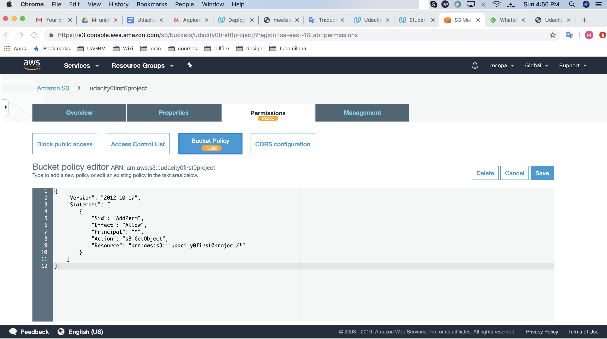

website URL = http://d2bsc96e9h5ggz.cloudfront.net/index.html

MEETS SPECIFICATIONS

The S3 bucket is visible in the AWS Management console.

The student has submitted a screenshot showing all the website files uploaded to the newly created S3 bucket.

The S3 bucket is configured to support static website hosting.

The S3 bucket has an IAM bucket policy that makes the bucket contents publicly accessible.

CloudFront has been configured to retrieve and distribute website files.

The website should be accessible to anyone on the Internet via a web browser. The student should have provided the CloudFront endpoint URL for the website.

